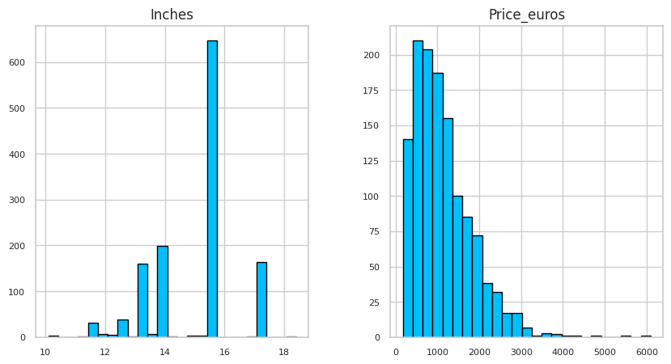
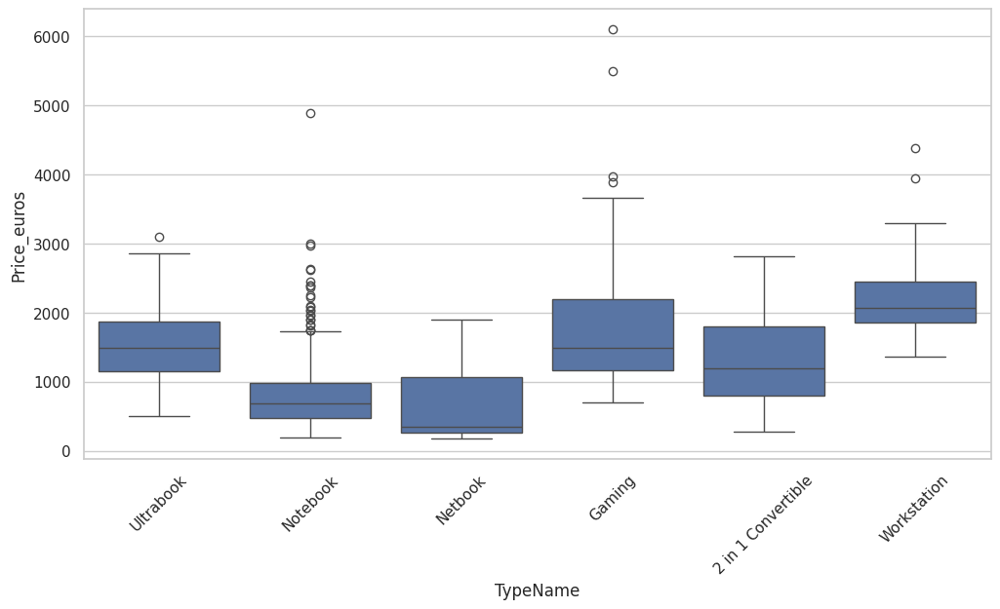
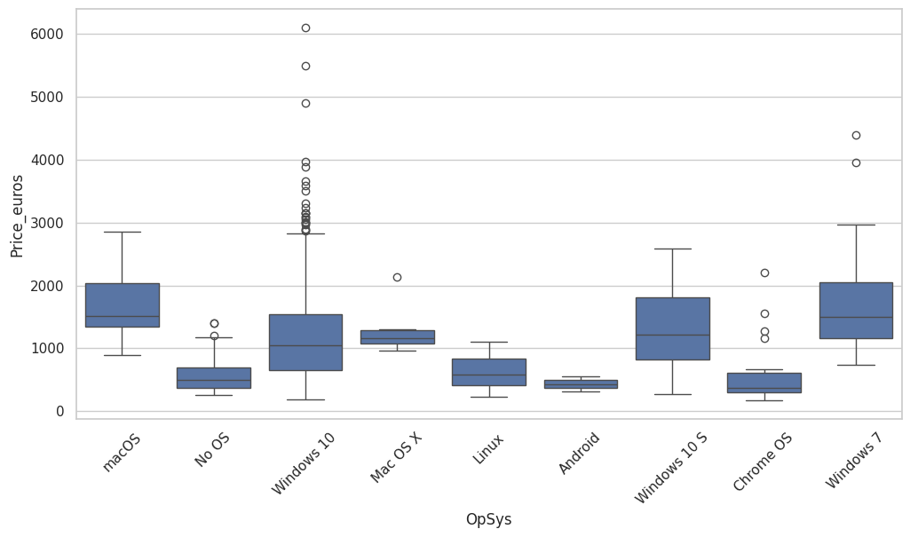
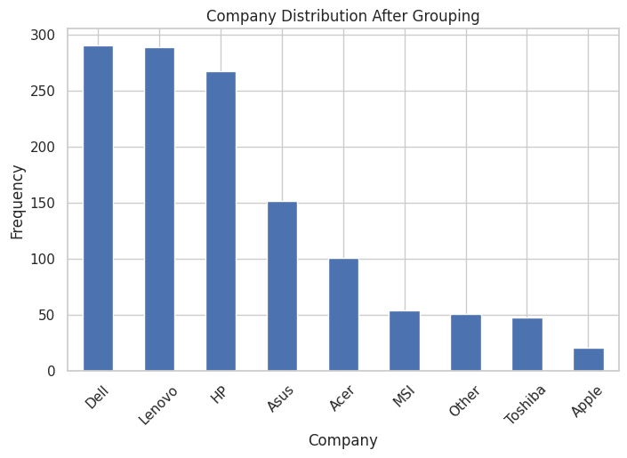
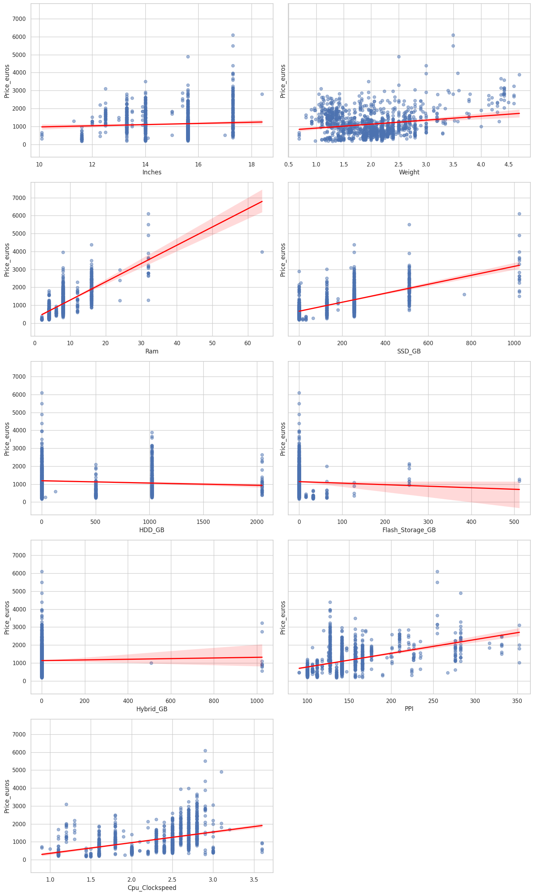
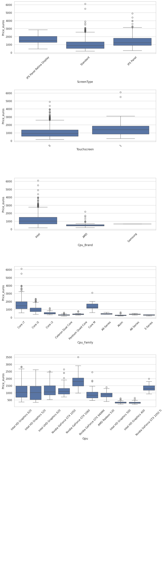
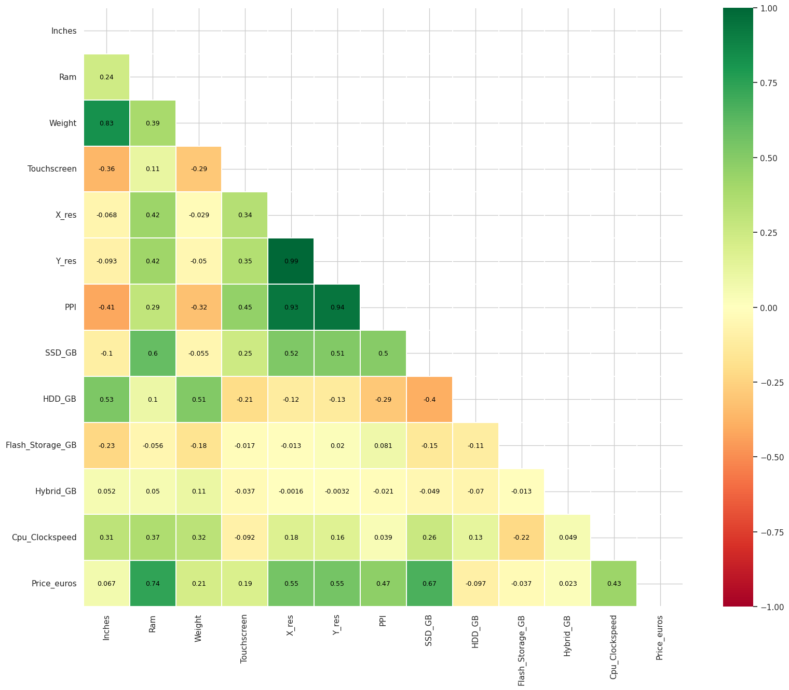

# Laptop Price Prediction

## Project Overview

This project develops a machine-learning regression workflow to predict laptop prices from product specifications. The analysis is implemented in [`laptop_price_prediction.ipynb`](./notebooks/laptop_price_prediction.ipynb) using the dataset in [`laptop_price.csv`](./data/raw/laptop_price.csv).

The notebook transforms semi-structured laptop attributes—including display, processor, RAM, storage, graphics processor, operating system, and weight—into model-ready features, then evaluates regression models for estimating `Price_euros`.

## Business Value

Laptop prices are influenced by many technical and product-level characteristics. A data-driven price-prediction model can support more consistent pricing decisions, enable marketplace price benchmarking, and help buyers or sellers assess the expected value of a laptop configuration.

Potential use cases include:

- **Marketplace pricing:** Estimate a reference price for a newly listed laptop.
- **Retail analytics:** Compare observed prices with model-based estimates to identify potential underpricing or overpricing.
- **Product benchmarking:** Quantify how hardware and design attributes relate to observed price levels.
- **Decision support:** Help users compare configurations using an evidence-based estimate rather than specifications alone.

## Dataset

The dataset is stored in [`laptop_price.csv`](./data/raw/laptop_price.csv) and contains 1,303 laptop records with 13 original columns. The target variable is `Price_euros`, representing the laptop price in euros.

| Column | Description |
|---|---|
| `laptop_ID` | Unique laptop identifier. |
| `Company` | Laptop manufacturer. |
| `Product` | Product or model name. |
| `TypeName` | Laptop category, such as Notebook or Ultrabook. |
| `Inches` | Display size in inches. |
| `ScreenResolution` | Screen technology and resolution. |
| `Cpu` | Processor description. |
| `Ram` | Installed RAM. |
| `Memory` | Storage configuration. |
| `Gpu` | Graphics processing unit. |
| `OpSys` | Operating system. |
| `Weight` | Laptop weight. |
| `Price_euros` | Laptop price in euros; the prediction target. |

The raw dataset has no missing values in the columns checked in the notebook. `Price_euros` ranges from €174.00 to €6,099.00, with a mean of approximately €1,123.69 and a median of €977.00.

## Repository Structure

```text
Laptop_Price_Prediction/
├── data/
│   └── raw/
│       └── laptop_price.csv
├── images/
├── models/
├── notebooks/
│   └── laptop_price_prediction.ipynb
├── requirements.txt
└── README.md
```

| Path | Description |
|---|---|
| `data/raw/laptop_price.csv` | Raw dataset containing laptop specifications and prices. |
| `images/` | Visualizations exported from the notebook and displayed in this README. |
| `models/` | Directory reserved for saved trained models. |
| `notebooks/laptop_price_prediction.ipynb` | End-to-end notebook for data cleaning, exploration, feature engineering, feature selection, and regression modeling. |
| `requirements.txt` | Python dependencies required to run the notebook. |
| `README.md` | Project documentation. |

## Methodology

The methodology below follows the section structure of [`laptop_price_prediction.ipynb`](./notebooks/laptop_price_prediction.ipynb).

### 0. Initial Setup

#### 0.1. Import Libraries

The notebook imports pandas and NumPy for data manipulation, Matplotlib and Seaborn for visualization, scikit-learn for preprocessing, pipelines, and modeling, and the XGBoost, LightGBM, and CatBoost libraries for gradient-boosted models.

#### 0.2. Load Laptop Price Dataset

The raw dataset is loaded from `data/raw/laptop_price.csv` into a pandas DataFrame. It contains 1,303 rows and 13 columns.

### 1. Data Handling and Cleaning

The notebook inspects column data types and descriptive statistics and confirms that the dataset has no missing values. The following cleaning steps are then applied:

- `laptop_ID` is dropped because it is an identifier rather than a meaningful predictor.
- 28 duplicate records are identified and removed, leaving 1,275 laptops.
- `Product` is dropped because it contains 618 unique model names, which would cause the model to overfit.
- `TypeName` values are checked and require no correction.

### 2. Initial Exploratory Data Analysis

Before feature engineering, `Inches` is the only numerical input feature. The price distribution is right-skewed: most laptops are priced around €1,000, with progressively fewer laptops at higher price points. After duplicate removal, the median price is €989, while the mean is slightly higher because of a small number of laptops priced above €2,000.



Boxplots of price against `Inches`, `Company`, `TypeName`, and `OpSys` show clear price differences between laptop categories. Workstations, gaming laptops, and ultrabooks are generally more expensive than notebooks and netbooks.



The operating-system boxplot shows that several labels, such as Android, Windows 10 S, Mac OS X, and macOS, contain very few observations, and that versions of the same operating system (e.g., Windows 7, Windows 10, and Windows 10 S) have similar price ranges. This motivates grouping operating systems into broader categories during feature engineering.



### 3. Feature Engineering

#### 3.1. Screen Type & Screen Resolution (X_res & Y_res)

`ScreenResolution` contains both the display type and the resolution, so it is split into several features:

- `ScreenType`, representing the panel type (e.g., IPS Panel or IPS Panel Retina Display).
- `Touchscreen`, a binary indicator for touchscreen support.
- `X_res` and `Y_res`, representing horizontal and vertical screen resolution.

##### 3.1.1. Pixels Per Inch (PPI)

`PPI` is calculated from `X_res`, `Y_res`, and `Inches` as a more informative measure of display sharpness:

$$\text{PPI} = \frac{\sqrt{X_{res}^2 + Y_{res}^2}}{\text{Inches}}$$

#### 3.2. Weight & Ram

The `kg` suffix is removed from `Weight` and the `GB` suffix is removed from `Ram`. The columns are converted to float and integer types, respectively.

#### 3.3. Memory

`Memory` can describe up to two storage devices of different types. It is parsed into four numerical capacity features: `SSD_GB`, `HDD_GB`, `Flash_Storage_GB`, and `Hybrid_GB`. Laptops with two drives of the same type have their capacities combined (e.g., 512GB SSD + 256GB SSD = 768GB SSD).

#### 3.4. CPU

`Cpu` is decomposed into three features:

- `Cpu_Brand`, such as Intel, AMD, or Samsung.
- `Cpu_Family`, such as Core i5, Core i7, Ryzen, or Celeron.
- `Cpu_Clockspeed`, representing processor speed in GHz as a float.

#### 3.5. GPU

The original `Gpu` feature is kept because the number of unique GPU names is manageable and each name already represents a meaningful hardware configuration. Formatting inconsistencies, such as extra whitespace, `GTX` spacing, and `1050 Ti` / `1050Ti` variants, are standardized to prevent the same GPU from being counted as separate categories.

#### 3.6. Operating Systems

Operating-system labels are consolidated into Windows, No OS, Linux, Chrome OS, Mac OS, and Android. After grouping, Windows accounts for 1,101 of the 1,275 laptops.

#### 3.7. Company

Manufacturers with fewer than 20 laptops are grouped into an `Other` category. Dell, Lenovo, and HP remain the most common manufacturers, together accounting for about two-thirds of the dataset.



### 4. Exploratory Data Analysis

#### 4.1. Numerical Features

Regression plots of each engineered numerical feature against `Price_euros` show that `Ram`, `SSD_GB`, `PPI`, and `Cpu_Clockspeed` have clear positive relationships with price. `HDD_GB`, `Flash_Storage_GB`, and `Hybrid_GB` show weak or slightly negative relationships.



#### 4.2. Categorical Features

Boxplots compare price across `ScreenType`, `Touchscreen`, `Cpu_Brand`, and the 10 most common `Cpu_Family` and `Gpu` values. They highlight price differences associated with panel type, touchscreen support, processor family, and graphics processor.



### 5. Train Test Split

`Price_euros` is separated as the target, and the remaining 19 columns are used as input features. The data is split into training (1,020 rows) and test (255 rows) sets using an 80/20 split with `random_state=42`.

### 6. Feature Selection

#### 6.1. Correlation Matrix and Heatmap

A correlation heatmap of the numerical features shows that:

- `Weight` is strongly correlated with `Inches` (0.83), because larger screens produce heavier laptops.
- `X_res` and `Y_res` are almost perfectly correlated (0.99), and both are strongly correlated with `PPI`. Therefore, `X_res` and `Y_res` are removed and `PPI` is kept.
- `Price_euros` is most strongly correlated with `Ram` (0.74), followed by `SSD_GB` (0.67), the resolution features, and `PPI`.



#### 6.2. CatBoost

CatBoost's `RecursiveByShapValues` feature selection is applied to the training set to select 13 features. The number 13 was chosen after experimenting with 10–15 features, as it performed best while limiting overfitting. The eliminated features are `Touchscreen`, `HDD_GB`, `Flash_Storage_GB`, and `Hybrid_GB`.

The selected features are `Company`, `TypeName`, `Inches`, `Ram`, `Gpu`, `OpSys`, `Weight`, `ScreenType`, `PPI`, `SSD_GB`, `Cpu_Brand`, `Cpu_Family`, and `Cpu_Clockspeed`.

### 7. Encoding and Standardization

A `ColumnTransformer` applies `StandardScaler` to the six selected numerical features and `OneHotEncoder(handle_unknown="ignore")` to the seven selected categorical features, all of which are nominal.

### 8. Modelling and Evaluation

#### 8.1. Initial Modelling

Seven regression models are trained as scikit-learn pipelines with the same preprocessor and evaluated on the training and test sets:

| Model | Train R² | Test R² | Test RMSE (€) |
|---|---:|---:|---:|
| Decision Tree | 0.9990 | 0.7784 | 331.65 |
| Ridge | 0.8569 | 0.8326 | 288.21 |
| Lasso | 0.8687 | 0.8089 | 307.96 |
| ElasticNet | 0.8630 | 0.8291 | 291.22 |
| Random Forest | 0.9732 | 0.8753 | 248.78 |
| **XGBoost** | **0.9898** | **0.8975** | **225.51** |
| LightGBM | 0.9299 | 0.8257 | 294.16 |

XGBoost achieves the highest test R² and the lowest test RMSE, so it is selected for hyperparameter tuning. The Decision Tree performs worst on the test set and shows strong overfitting.

#### 8.2. Hyperparameter Tuning and Optimization

`GridSearchCV` with 5-fold cross-validation searches 108 combinations of `n_estimators`, `max_depth`, `learning_rate`, `subsample`, and `colsample_bytree` for XGBoost. The tuned model does not outperform the default XGBoost model, so the untuned model is kept as the final model.

The final model's test-set performance is:

| Metric | Value |
|---|---:|
| MAE | €159.22 |
| MSE | 50,856.53 |
| RMSE | €225.51 |
| R² | 0.8975 |

The most important encoded features in the final model are `Ram`, `TypeName_Notebook`, `Cpu_Family_Core i7`, `TypeName_Workstation`, and `Gpu_Nvidia GeForce GTX 1070`.

## Results Summary

The notebook demonstrates that raw product specifications can be converted into structured variables suitable for laptop-price regression. Feature engineering provides explicit representations of display resolution, pixel density, touchscreen capability, CPU characteristics, RAM, weight, operating system, storage, and graphics information.

The dataset has a right-skewed price distribution, with a relatively small number of premium laptops at the upper end of the price range. Therefore, model performance should be interpreted across both typical configurations and high-priced laptops rather than through one metric alone.

For complete experimental outputs, visualizations, fitted-model results, and exact performance values, run [`laptop_price_prediction.ipynb`](./notebooks/laptop_price_prediction.ipynb) from top to bottom.

## How to Run

### 1. Environment Setup

Clone the repository and move into the project directory:

```bash
git clone https://github.com/arigourumsah/Laptop_Price_Prediction.git
cd Laptop_Price_Prediction
```

Create and activate a virtual environment:

```bash
python -m venv .venv
source .venv/bin/activate
```

For Windows PowerShell:

```powershell
.venv\Scripts\Activate.ps1
```

Install the project dependencies:

```bash
pip install -r requirements.txt
```

### 2. Run the Notebook

Launch Jupyter Notebook:

```bash
jupyter notebook
```

Open `notebooks/laptop_price_prediction.ipynb`, then run the notebook cells sequentially from top to bottom. This reproduces the data preparation, exploratory analysis, feature engineering, model training, and evaluation workflow.

## Possible Extensions

- Add automated hyperparameter tuning and cross-validation for model selection.
- Compare additional regression algorithms, such as Random Forest, Gradient Boosting, XGBoost, CatBoost, or LightGBM.
- Apply logarithmic transformation to `Price_euros` to better handle the right-skewed target distribution.
- Extract structured storage features, such as SSD, HDD, hybrid storage, flash storage, and storage capacity.
- Group detailed GPU values into manufacturer and graphics-family features.
- Add model explainability with permutation importance or SHAP values.
- Package the trained model as an interactive Streamlit or Flask application for laptop-price estimation.
- Use a more recent and geographically diverse laptop dataset to evaluate model robustness across markets and time periods.
